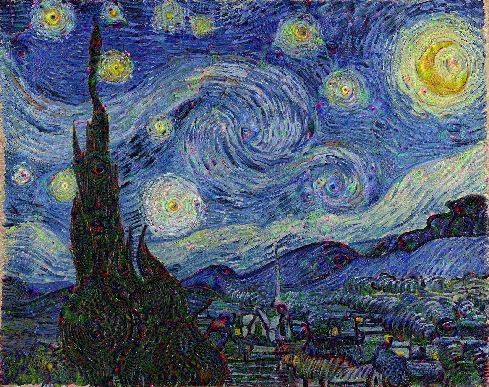
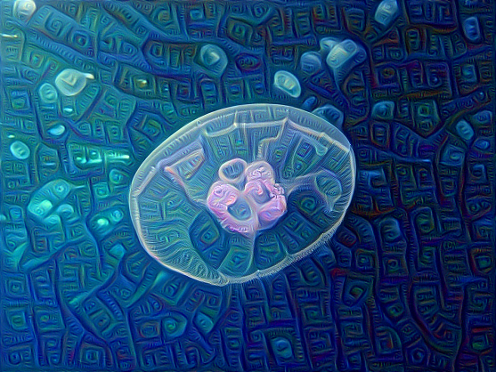
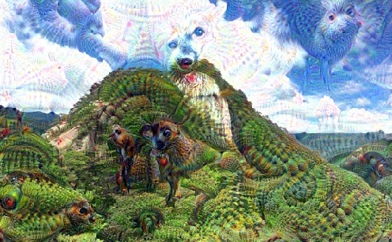
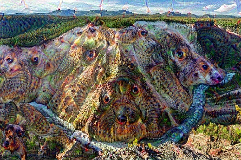

# DeepDream, Inception V1, Tensorflow 2.x

- Inception V1 model를 이용하여 이미지 생성: tensorflow 1.x로 train된 proto buffer(pb) 파일을 다운받은 후, tensorflow 2.x에서 로드.
- Inception V1이 Inception V3보다 더 다양한 이미지를 잘 만듬.
- ipywidget을 이용하여, 편리하게 parameter 변경
- zooming 효과로 이미지 생성
- animated git 생성
- 구현코드는 jupyte notebook [파일]().

