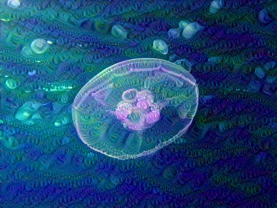

# DeepDream, Inception V1, Tensorflow 2.x

- Inception V1 model를 이용하여 이미지 생성: tensorflow 1.x로 train된 proto buffer(pb) 파일을 다운받은 후, tensorflow 2.x에서 로드.
    * [Tensorflow Tutorial](https://www.tensorflow.org/tutorials/generative/deepdream?hl=ko)에 Deep Dream에서는 Inception V3 모델을 사용하고 있고, 제가 본 몇몇 책에서도 Inception V3를 사용.
    * Inception V3로 이미지를 생성하면, 좀 멋진(?) 이미지가 잘 안 나옴.
    !
    
    * Inception V1이 Inception V3보다 더 다양한 이미지를 잘 만듬.
- ipywidget을 이용하여, 편리하게 parameter 변경
- zooming 효과로 이미지 생성
- animated git 생성
- 구현코드는 jupyte notebook [파일](https://github.com/hccho2/DeepDream/blob/main/deemdream_InceptionV1_TF2.ipynb).  --> google colab에서 작성했습니다.

